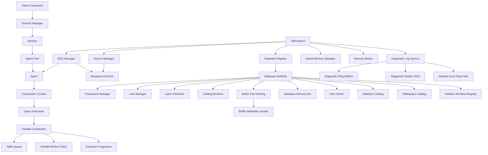

# Day 1 Runtime Foundation

Feature Name: day1-runtime-foundation
Updated: 2026-05-24

## Description

This design defines the first formal implementation milestone for a serious C++ relational database engine. The goal of Day 1 is to establish the engine runtime foundation before SQL, storage, recovery, or query processing internals are implemented.

The Day 1 runtime foundation introduces:

1. A top-level instance runtime model
2. A database activation model
3. An EDU-based execution framework
4. An agent-based application servicing model
5. Hierarchical memory domains
6. Explicit C++ ownership rules
7. Runtime registry and interruption control
8. A minimal implementation and test plan
9. A concurrency vocabulary that separates logical locks, internal latches, and parallel exchange coordination
10. A memory-governance model with named shared and private memory classes
11. Reserved optimizer architecture concepts for statistics, access-path enumeration, costing, and plan caching
12. Reserved storage-placement concepts that expose optimizer-visible I/O cost surfaces through tablespaces and storage classes
13. A pooled session and agent model that separates connected client state from leased execution capacity
14. Reserved coordinator and subagent vocabulary for future parallel and partitioned execution
15. An asynchronous diagnostic logging model that preserves troubleshooting value without blocking critical foreground code paths

## Architecture



### Runtime hierarchy

The Day 1 runtime model is organized around four major scope boundaries:

1. `DBInstance`
2. `DatabaseRuntime`
3. `Session` or `ApplicationContext`
4. `QueryExecution`
5. pooled `Agent` attachment

The system follows a DB2-inspired runtime model where the instance is the root operational boundary, database runtimes are activatable children, and both foreground and background engine work are represented through EDUs.

The runtime must also separate durable client state from leased execution capacity:

1. `Session` is a long-lived logical client attachment
2. `Agent` is a pooled execution resource that attaches to a session only while work is active
3. `CoordinatorContext` is a request-scoped control role carried by an attached agent
4. future `Subagent` roles are worker-side execution roles for parallel or partition-local fragments

### Concurrency domains

The engine architecture must treat three concurrency domains as distinct design concerns:

1. **Logical locks** for user-visible data protection and transaction isolation
2. **Internal latches** for short critical sections over shared engine memory structures
3. **Parallel exchange queues** for coordinator or worker communication during parallel execution

These domains have different ownership, duration, observability, and failure behavior. The engine must keep them separated in both interfaces and metrics.

### Optimization and memory-governance domains

The engine must also treat optimizer intelligence and memory governance as first-class architectural domains:

1. **Statistics and access-path optimization** determine plan quality and concurrency shape
2. **Named memory pools** determine runtime stability, cache effectiveness, and query execution behavior
3. **Memory brokerage** determines how shared and transient memory consumers coexist under global limits
4. **Storage placement metadata** determines how I/O cost enters access-path selection
5. **Stable tuple and index identity** determine how heap movement, fragmentation, and deferred maintenance preserve lookup correctness
6. **Clustering and maintenance metadata** determine how physical organization decay enters planning and background utility work
7. **Diagnostic event buffering and suppression** determine whether troubleshooting remains available during client, network, or I/O fault storms

## Repository Layout

The Day 1 repository layout must match the Day 1 runtime bootstrap plan and expose the major code, test, tool, and documentation boundaries from the start.

```text
/northdb
  /cmake
  /docs
    /architecture
  /src
    /common
    /runtime
    /memory
    /network
    /catalog
    /storage
    /txn
    /lock
    /wal
    /recovery
    /executor
    /parser
    /optimizer
    /utility
    /replication
  /tests
    /unit
    /integration
  /tools
```

The implementation scope for Day 1 task `1.1` is the creation of this repository scaffold only. The task does not yet require class skeletons, build rules, or executable tests.

## Components and Interfaces

### 1. `DBInstance`

`DBInstance` is the top-level owner of the database engine runtime.

Responsibilities:

1. Own global configuration
2. Own the global memory root
3. Own runtime registries and managers
4. Start and stop core services
5. Coordinate database activation and shutdown
6. Enter quiesce state for controlled shutdown or maintenance
7. Own instance-level memory governance and arbitration across shared and transient memory consumers

Core API:

```cpp
class DBInstance {
public:
    Status Initialize();
    Status Start();
    Status Quiesce();
    Status Stop();
    InstanceState State() const noexcept;
};
```

Additional reserved Day 1 concepts:

1. `MemoryBroker`
2. instance-shared memory classes
3. utility-reservation and query-grant policy hooks
4. `DiagnosticLogService`

### 2. `DatabaseRuntime`

`DatabaseRuntime` is the in-memory runtime container for one database.

Responsibilities:

1. Activate database-local services
2. Coordinate mount and recovery stages
3. Expose database-level transaction and lock systems
4. Own the database memory root
5. Support quiesce and deactivate flows
6. Coordinate database-level logical locking and internal latch policy boundaries
7. Own database-shared memory pools such as plan cache, catalog cache, and lock-related memory
8. Expose optimizer-visible statistics and shared cache ownership boundaries
9. Expose optimizer-visible storage placement and storage cost metadata through catalog-managed abstractions

Core API:

```cpp
class DatabaseRuntime {
public:
    Status Activate();
    Status Recover();
    Status Quiesce();
    Status Deactivate();
    DatabaseState State() const noexcept;
};
```

Additional reserved Day 1 concepts:

1. `DatabaseMemorySet`
2. `PlanCache`
3. `StatisticsCatalog`
4. `TablespaceCatalog`
5. member-local diagnostic file identity

### 3. `EDU`

`EDU` is the common execution abstraction for all engine work.

Concurrency-related EDU roles include:

1. Foreground agent execution that acquires logical locks through transaction-aware paths
2. Background deadlock detection for logical lock waits
3. Parallel worker execution that may contend on table queues and buffer metadata latches
4. Future partition-local execution workers that run coordinator-dispatched fragments

Foreground EDU examples:

1. `AgentEDU`
2. `UtilityJobEDU`
3. `ParallelQueryWorkerEDU` in later phases
4. `PartitionWorkerEDU` in later phases

Background EDU examples:

1. `LogWriterEDU`
2. `PageCleanerEDU`
3. `CheckpointEDU`
4. `PrefetchEDU`
5. `DeadlockDetectorEDU`
6. `RecoveryMasterEDU`
7. `RecoveryWorkerEDU`
8. `DiagnosticFlusherEDU`

Core interface:

```cpp
class EDU {
public:
    virtual ~EDU() = default;
    virtual EduId Id() const noexcept = 0;
    virtual EDUType Type() const noexcept = 0;
    virtual std::string_view Name() const noexcept = 0;
    virtual void Run() = 0;
    virtual void RequestStop() = 0;
};
```

### 4. `Agent`

`Agent` is the pooled foreground runtime unit that services an application request while attached to a session.

Responsibilities:

1. Bind to a session for request execution
2. Own query-scoped execution state while active
3. Attach to transaction state
4. Enforce cancellation and timeout checks
5. Report execution metrics and status
6. Surface wait classification for lock waits, latch waits, queue waits, and other runtime waits
7. Return to the agent pool after request completion or defined suspension boundaries

Design principles:

1. Agents are leased execution capacity rather than durable client identity
2. A session may exist without an attached agent while client state remains connected
3. Coordinator responsibility is a request-scoped role, not a permanent thread identity
4. Future waits such as client-idle or remote-partition waits must not force permanent exclusive worker ownership

Execution path:

```text
Connection -> Session -> Agent Attachment -> Coordinator Context -> Transaction Context -> QueryExecution
```

### 5. `Session`

`Session` is the long-lived client runtime context.

Responsibilities:

1. Authentication state
2. Session variables
3. Prepared statement cache later
4. Session memory context
5. Current transaction binding
6. Interrupt token root
7. Durable attachment identity independent of a continuously assigned worker

Design principles:

1. Session state must live in durable heap-owned runtime structures rather than transient agent stack state
2. Session-to-agent attachment must be explicit and reversible around active work and wait states
3. Future connection concentration depends on sessions remaining cheaper than permanently dedicated execution workers

### 5A. `AgentPool` and coordinator or subagent direction

The runtime should later use bounded pools of foreground execution agents.

Design principles:

1. Attached foreground work uses a coordinator role carried by the active agent
2. Future worker or subagent roles execute parallel or partition-local fragments on behalf of the coordinator
3. Each future database partition may later own a local worker pool for partition-local execution
4. Runtime accounting must distinguish connected sessions from active agents and idle pooled agents

Reserved future concepts:

1. `AgentPool`
2. `CoordinatorContext`
3. `ExecutionFragment`
4. `SubagentRole`
5. `PartitionAgentPool`

### 5B. `DiagnosticLogService`

`DiagnosticLogService` is the asynchronous diagnostic logging subsystem for runtime, engine, and client-facing fault records.

Responsibilities:

1. Accept structured diagnostic event publication from foreground and background producers
2. Reserve slots in bounded preallocated buffers without file open or close operations on producer threads
3. Assign stable sequence numbers and preserve event provenance metadata for later investigation
4. Flush diagnostic records to member-local append-only log files by time, space, or severity-triggered policy
5. Apply suppression, rate limiting, and overflow policy during repetitive event storms
6. Record explicit drop, suppression, and backlog diagnostics when loss or sampling occurs
7. Support crash-path emergency flush with preallocated memory only

Design principles:

1. Foreground logging must be non-blocking with respect to diagnostic file I/O and file locking
2. Producer publication must rely on bounded preallocated memory and lock-free or near-lock-free slot reservation
3. Investigation quality must depend on structured metadata rather than incidental file write order alone
4. High-volume client and SSL failure floods must degrade into suppression summaries rather than engine-wide stalls
5. Diagnostic logging must stay member-local in future multinode deployments

Reserved future concepts:

1. `DiagnosticRecord`
2. `DiagnosticRingBuffer`
3. `DiagnosticPublishSlot`
4. `DiagnosticFlusherPolicy`
5. `DiagnosticSuppressionKey`
6. `DiagnosticDropAccounting`

### 6. Logical locking model

Logical locks protect user-visible data and schema resources.

Design principles:

1. Locks are owned by transaction or session state
2. Locks are isolation-aware and waitable
3. Locks participate in deadlock detection
4. Lock scopes will later include row, page, table, and higher-level object scopes
5. Lock escalation is a policy mechanism to trade concurrency for bounded lock-table pressure

Initial reserved interfaces:

```text
src/lock/lock_mode.h
src/lock/lock_request.h
src/lock/lock_manager.h
src/lock/lock_escalation_policy.h
```

### 7. Internal latch model

Latches protect internal shared-memory structures such as buffer-pool metadata, queue state, and other high-frequency engine structures.

Design principles:

1. Latches are held for very short critical sections
2. Latches are not transaction-visible resources
3. Latches must not be held across blocking I/O
4. Latches must not be held while waiting on logical locks
5. Latch contention must be observable by latch class and protected structure

Initial reserved interfaces:

```text
src/storage/latch.h
src/storage/latch_guard.h
```

### 8. Parallel exchange coordination

Parallel execution introduces an independent coordination domain through shared exchange queues.

Design principles:

1. Parallel workers communicate through bounded queue structures
2. Queue contention must be treated as an execution and optimizer cost
3. Highly selective row-goal queries should later suppress parallel fan-out when queue and latch overhead outweighs scan benefit
4. Coordinator-to-worker and future coordinator-to-partition execution should share fragment-oriented control vocabulary rather than raw thread assumptions

Initial reserved interfaces:

```text
src/executor/table_queue.h
src/executor/parallel_execution_policy.h
```

### 9. Optimizer architecture

The optimizer design must be explicitly cost-based and statistics-driven.

Design principles:

1. Logical rewrite and physical access-path selection must remain separate stages
2. Statistics are a first-class catalog concern that directly influence cardinality and cost estimation
3. Index usage is determined by access-path cost, selectivity, and plan shape rather than by index existence alone
4. Parallel exchange overhead and memory pressure must later be visible to the cost model
5. Plan caching must later be an explicit shared-memory consumer with invalidation rules tied to catalog or statistics changes
6. Storage placement and I/O cost parameters must later be visible to the cost model through tablespace and storage-class metadata
7. Clustering quality, index fragmentation, and stale-entry backlog must later be visible to the cost model for scan and probe planning
8. Partitioned-table planning must later distinguish local partitioned indexes from future global indexes
9. Future fragment placement, exchange cost, and coordinator-to-worker fan-out must remain visible to the cost model

Initial reserved interfaces:

```text
src/optimizer/statistics_catalog.h
src/optimizer/cardinality_estimator.h
src/optimizer/access_path_enumerator.h
src/optimizer/cost_model.h
src/optimizer/plan_cache.h
src/optimizer/explain_formatter.h
```

### 10. Storage placement architecture

The storage design must separate logical placement metadata from physical device topology.

Design principles:

1. Tables and indexes must later be assigned to logical tablespaces
2. Tablespaces must later reference summarized storage classes rather than exposing raw device topology to the optimizer
3. The optimizer must consume storage-cost profiles, including fixed I/O overhead and transfer-rate style parameters
4. Storage placement changes must later become visible to planning and explain output

Reserved catalog-visible abstractions:

1. `Tablespace`
2. `StorageClass`
3. `StorageCostProfile`

Illustrative cost-profile fields:

1. fixed I/O overhead
2. transfer rate
3. page size
4. sequential prefetch multiplier
5. random-versus-sequential penalty ratio

Reserved interfaces:

```text
src/storage/tablespace.h
src/storage/storage_class.h
src/storage/storage_cost_profile.h
src/catalog/tablespace_catalog.h
```

### 10A. Heap and index organization direction

The future storage engine should adopt stable tuple identity and page-oriented B+ tree indexes as baseline structures.

Design principles:

1. Heap storage should later provide a stable tuple identifier that can survive many secondary-index-visible row changes.
2. Secondary indexes should later use page-oriented B+ tree structures with ordered leaf traversal.
3. Secondary-index probes should later support tuple revalidation when index entries can outlive physical row placement changes.
4. Foreground delete and update paths may later leave stale index entries behind a correctness-preserving revalidation boundary.
5. Index and heap maintenance should later separate correctness from physical compaction so that cleanup can be throttled independently.

Reserved future concepts:

1. `TupleId`
2. `PageId`
3. tuple indirection or forwarding metadata
4. index leaf sibling links
5. stale-index-entry cleanup backlog

### 10B. Physical organization and maintenance direction

The future storage engine and utility framework should treat physical-organization decay as a measurable and repairable state.

Design principles:

1. Index maintenance should later support asynchronous cleanup of invalid secondary-index entries.
2. Online maintenance should later support compaction or defragmentation without requiring exclusive rebuild-only workflows.
3. The catalog and optimizer should later track clustering quality, page density, and cleanup backlog as planning inputs.
4. Partitioned tables should later support local partitioned indexes before any partition-spanning global index design.
5. Specialized layouts inspired by MDC and ITC should be introduced only after the baseline heap and B+ tree model is stable.

Explicit Day 1 deferrals:

1. MDC-style multidimensional clustered storage
2. ITC-style insert-time clustered storage
3. BID-oriented block index structures
4. global partition-spanning nonpartitioned indexes
5. full online index defragmentation utilities

### 11. Memory-governance model

The engine memory model must distinguish long-lived shared memory from transient work memory.

Named memory classes:

1. `InstanceSharedMemory`
2. `DatabaseSharedMemory`
3. `SessionPrivateMemory`
4. `TransactionPrivateMemory`
5. `AgentRuntimeMemory`
6. `QueryWorkMemory`
7. `UtilityWorkMemory`
8. `ExchangeBufferMemory`
9. `DiagnosticBufferMemory`
10. `DiagnosticEmergencyMemory`

Design principles:

1. Shared pools must have named budgets and observability
2. Query operators that need work memory must later request grants under a brokered policy
3. Sort, hash, and exchange operators must later support spill-aware behavior when memory grants are insufficient
4. Plan cache and catalog cache must be modeled as explicit shared consumers, not incidental allocations
5. Durable session memory must stay distinct from transient agent runtime memory
6. Future exchange and transport buffers must remain explicit consumers for parallel and partitioned execution
7. Diagnostic publication and crash-flush memory must remain explicit bounded shared consumers

Reserved shared-memory pool examples:

1. buffer pool
2. plan cache
3. catalog cache
4. lock memory
5. utility coordination memory
6. diagnostic ring buffers
7. diagnostic emergency buffer

### 12. `MemoryContext`

`MemoryContext` is the fundamental allocation, accounting, and cleanup abstraction.

Core interface:

```cpp
class MemoryContext {
public:
    virtual ~MemoryContext() = default;
    virtual void* Allocate(size_t bytes,
                           size_t alignment = alignof(std::max_align_t)) = 0;
    virtual void Deallocate(void* ptr, size_t bytes) = 0;
    virtual void Reset() = 0;
    virtual size_t UsedBytes() const noexcept = 0;
    virtual size_t PeakBytes() const noexcept = 0;
    virtual size_t LimitBytes() const noexcept = 0;
};
```

### 13. `ServiceManager`

`ServiceManager` is responsible for lifecycle coordination of always-on engine services.

Responsibilities:

1. Register services
2. Start services in a defined order
3. Stop services in a defined order
4. Propagate failures into runtime state
5. Start the diagnostic flusher before normal foreground workload admission

### 14. `RuntimeRegistry` and `InterruptToken`

`RuntimeRegistry` tracks active engine objects.

The runtime registry and future diagnostics model must classify waits by domain, including:

1. lock waits
2. latch waits
3. queue waits
4. I/O waits
5. log flush waits
6. client waits
7. remote waits
8. diagnostic backpressure waits reserved for maintenance-only paths

Tracked entity classes:

1. Session
2. Agent
3. Transaction
4. Query
5. Utility job
6. EDU
7. Coordinator context
8. Execution fragment
9. Diagnostic flusher

The runtime registry and diagnostics model must also track:

1. diagnostic queue occupancy
2. diagnostic records published
3. diagnostic records flushed
4. diagnostic records suppressed
5. diagnostic records dropped
6. diagnostic flush latency
7. diagnostic backlog age

`InterruptToken` carries runtime cancel and timeout requests.

All long-running operations must be designed to poll this token.

## Data Models

### Runtime identity types

```cpp
using InstanceId = uint64_t;
using DatabaseId = uint64_t;
using SessionId = uint64_t;
using TransactionId = uint64_t;
using QueryId = uint64_t;
using EduId = uint64_t;
using DiagnosticSequence = uint64_t;
```

### Wait-event vocabulary

```cpp
enum class WaitEventClass {
    kNone,
    kLock,
    kLatch,
    kQueue,
    kIo,
    kLogFlush,
    kClient,
    kRemote,
    kDiagnostic
};
```

### Reserved diagnostic-severity vocabulary

```cpp
enum class DiagnosticSeverity {
    kDebug,
    kInfo,
    kEvent,
    kWarn,
    kError,
    kFatal
};
```

### Reserved diagnostic-record header vocabulary

```cpp
struct DiagnosticRecordHeader {
    DiagnosticSequence global_sequence;
    DiagnosticSequence member_sequence;
    std::uint64_t event_time_unix_micros;
    std::uint64_t event_time_monotonic_nanos;
    DiagnosticSeverity severity;
    WaitEventClass wait_class;
    InstanceId instance_id;
    DatabaseId database_id;
    SessionId session_id;
    QueryId query_id;
    EduId edu_id;
    std::uint32_t member_id;
    std::uint32_t process_id;
    std::uint32_t thread_id;
    std::uint32_t component_id;
    std::uint32_t function_id;
    std::uint32_t probe_id;
    std::uint32_t flags;
};
```

### Reserved memory-pool identity vocabulary

```cpp
enum class MemoryPoolClass {
    kInstanceShared,
    kDatabaseShared,
    kSessionPrivate,
    kTransactionPrivate,
    kAgentRuntime,
    kQueryWork,
    kUtilityWork,
    kExchangeBuffer,
    kPlanCache,
    kCatalogCache,
    kLockMemory,
    kBufferPool,
    kDiagnosticBuffer,
    kDiagnosticEmergency
};
```

### Reserved storage identity vocabulary

```cpp
using TablespaceId = std::uint64_t;
using StorageClassId = std::uint64_t;
using StorageCostProfileId = std::uint64_t;
using TupleId = std::uint64_t;
using PageId = std::uint64_t;
```

### Instance state machine

```cpp
enum class InstanceState {
    kCreated,
    kInitializing,
    kRecovering,
    kRunning,
    kQuiescing,
    kStopping,
    kStopped,
    kFailed
};
```

Valid transition flow:

```text
kCreated -> kInitializing -> kRecovering -> kRunning
kRunning -> kQuiescing -> kStopping -> kStopped
Any operational state -> kFailed
```

### Database state machine

```cpp
enum class DatabaseState {
    kRegistered,
    kMounting,
    kRecovering,
    kActive,
    kQuiesced,
    kStopping,
    kStopped,
    kFailed
};
```

Valid transition flow:

```text
kRegistered -> kMounting -> kRecovering -> kActive
kActive -> kQuiesced -> kStopping -> kStopped
Any operational state -> kFailed
```

### Agent state machine

```cpp
enum class AgentState {
    kIdle,
    kAssigned,
    kRunning,
    kWaiting,
    kDetachedWaiting,
    kCancelling,
    kFinished,
    kFailed
};
```

### Reserved session and execution vocabulary

```cpp
enum class SessionState {
    kConnected,
    kRunnable,
    kWaiting,
    kIdle,
    kClosed,
    kFailed
};

enum class ExecutionRole {
    kCoordinator,
    kSubagent,
    kUtility,
    kBackground
};
```

### Memory context hierarchy

```text
InstanceMemoryContext
  |- ServiceMemoryContext
  |- AgentPoolMemoryContext
  |- InstanceSharedMemoryContext
  |    |- BufferPoolMemoryContext
  |    |- WALMemoryContext
  |    |- RecoveryMemoryContext
  |- DatabaseMemoryContext(db1)
  |    |- DatabaseSharedMemoryContext
  |    |    |- CatalogCacheMemoryContext
  |    |    |- PlanCacheMemoryContext
  |    |    |- LockSystemMemoryContext
  |    |    |- LatchSystemMemoryContext
  |    |    |- UtilityCoordinationMemoryContext
  |    |- TxnSystemMemoryContext
  |    |- SessionMemoryContext(s1)
  |    |    |- TransactionMemoryContext(tx1)
  |    |    |- QueryMemoryContext(q1)
  |    |    |    |- OperatorMemoryContext(scan)
  |    |    |    |- OperatorMemoryContext(hash_join)
  |    |    |    |- OperatorMemoryContext(exchange_queue)
  |    |    |- AgentAttachmentMemoryContext(a1)
   |    |    |- QueryMemoryContext(q2)
   |    |- SessionMemoryContext(s2)
   |- DatabaseMemoryContext(db2)
```

## Correctness Properties

### Ownership and lifecycle invariants

1. Every runtime object must have one clear lifecycle owner.
2. Every memory scope must have one clear parent scope except the instance root.
3. Every active query must execute under exactly one agent.
4. Every active agent must be associated with at most one active request.
5. Every database runtime must belong to exactly one instance.
6. Every long-running operation must have an interrupt token.
7. No logical lock wait may occur while a latch critical section is held.
8. No blocking I/O may occur while a latch critical section is held.
9. Every shared memory consumer must belong to a named memory class with an observable budget.
10. Every query work-memory consumer must later execute under an explicit grant or spill policy.
11. Every persistent data object must later have a logical placement identity that the optimizer can resolve to summarized storage costs.
12. Every future secondary-index lookup must preserve correctness through tuple revalidation when physical row placement can change independently from index cleanup.
13. Every connected session may exist without a continuously attached agent.
14. Every coordinator role must be bound to an active request rather than to a permanent worker identity.
15. Every published diagnostic record must receive a stable sequence number before it becomes visible to the flusher.
16. Foreground diagnostic publication must not require diagnostic file lock acquisition.

### C++ ownership rules

1. Exclusive subsystem ownership uses `std::unique_ptr`.
2. Non-owning object references use raw pointers or references.
3. Scoped resource release must use RAII guards.
4. Query-local containers should be compatible with `std::pmr` or equivalent scoped allocation strategies.

### Runtime control invariants

1. Invalid lifecycle transitions return explicit failure status.
2. Quiesce state stops admission of new work before shutdown continues.
3. Session teardown must release session memory and detach active request state.
4. Query teardown must release query and operator memory contexts.
5. Wait reporting must preserve the distinction between lock, latch, and queue contention.
6. Plan cache and statistics changes later require explicit invalidation or refresh hooks.
7. Storage-cost metadata changes later require explicit plan-review or invalidation hooks.
8. Agent detach and reattach boundaries must preserve session and transaction correctness.
9. Diagnostic publication must remain available during diagnostic file rotation and transient file I/O stalls through bounded buffering.
10. Suppression and drop summaries must be emitted as explicit diagnostic records when normal repetitive records are curtailed.

### Concurrency-control invariants

1. Logical locks and internal latches use separate APIs and ownership paths.
2. Lock escalation later becomes policy-driven and observable.
3. Parallel exchange queues later become explicit execution objects rather than implicit thread communication paths.
4. Buffer-pool metadata latching later uses sharded or partitioned protection to reduce central contention.
5. Access-path costing later depends on optimizer-visible statistics and available work-memory assumptions.
6. Access-path costing later depends on optimizer-visible storage-cost profiles for scans, probes, and spill destinations.
7. Access-path costing later depends on optimizer-visible clustering and fragmentation signals for heap and index access.
8. Partitioned-table access planning later distinguishes local partitioned indexes from future global index designs.
9. Future coordinator or subagent execution must preserve explicit fragment boundaries across local parallel or partitioned execution.
10. Diagnostic logging paths must not introduce unbounded latch or file-lock contention into normal connection handling or critical execution paths.

## Error Handling

### Startup and lifecycle errors

1. If instance initialization fails, the instance enters `kFailed`.
2. If database activation fails, the database enters `kFailed`.
3. If service startup fails, the owning runtime returns an error and records the failure state.

### Memory errors

1. If a memory context exceeds a configured hard limit, the allocator returns an explicit failure.
2. Query-scoped memory-limit breaches should later integrate with spill policies for sort and hash operators.

### Concurrency errors

1. Lock timeouts, deadlocks, and cancellation outcomes must be reported separately from latch contention.
2. Parallel queue overload or queue shutdown must surface a dedicated execution failure status.
3. Future stale secondary-index entries must surface through bounded probe revalidation rather than silent wrong-row visibility.
4. Agent-pool exhaustion or admission delay must surface through explicit scheduling and wait diagnostics.
5. Diagnostic queue saturation must surface through explicit drop or suppression accounting rather than foreground indefinite waiting.

### Optimization and memory-governance errors

1. Missing or stale statistics later must surface as degraded plan quality signals through diagnostics rather than silent opaque behavior.
2. Memory-grant denial later must surface as an explicit execution status or a spill path decision.
3. Storage-profile misconfiguration later must surface through explainable cost shifts and plan-drift diagnostics.
4. Cleanup backlog, fragmentation growth, and clustering decay later must surface through maintenance and plan diagnostics.

### Diagnostic logging errors

1. Diagnostic file I/O stalls must degrade into buffered backlog growth, suppression, and drop accounting before they affect foreground request progress.
2. Diagnostic record storms from repeated client, SSL, or network failures must degrade into bounded repeated-event summaries.
3. Diagnostic crash flush must avoid dynamic allocation and non-essential lock acquisition.

### Interruption errors

1. If an interrupt token is set to cancelled, active work returns a cancellation status.
2. If an interrupt token is set to timeout, active work returns a timeout status.

## Test Strategy

### Unit tests

Required Day 1 unit-test targets:

1. Instance lifecycle transitions
2. Database lifecycle transitions
3. Agent lifecycle transitions
4. Memory context usage and peak tracking
5. Interrupt token behavior
6. Service manager start and stop ordering
7. shared identity and status types
8. future memory-pool and wait-event type stability once the reserved interfaces exist
9. future diagnostic record ordering, suppression, and overflow-policy stability once the reserved interfaces exist

### Example test names

1. `DBInstance_TransitionsToRunning`
2. `DBInstance_RejectsInvalidStopBeforeStart`
3. `DatabaseRuntime_ActivateRecoverDeactivateFlow`
4. `MemoryContext_TracksUsageAndPeak`
5. `InterruptToken_RequestsCancel`
6. `Agent_TransitionsIdleAssignedRunningFinished`
7. `ServiceManager_StartsServicesInOrder`
8. `DiagnosticLogService_PreservesSequenceAcrossAsyncFlush`
9. `DiagnosticLogService_EmitsSuppressionSummary`

### Scope exclusions for Day 1

The following are intentionally out of scope for Day 1 implementation:

1. SQL parsing
2. Storage engine internals
3. WAL record format
4. Query optimizer internals
5. Lock table implementation
6. Executor operator implementation
7. Full diagnostic logger implementation

The following design obligations are introduced for later phases:

1. Separate lock-manager and latch-layer implementations
2. Observability for lock waits, latch waits, queue waits, and escalation
3. Parallel-execution policy that suppresses costly exchange paths for row-goal selective plans
4. Statistics-driven optimizer implementation with explainable access-path selection
5. Memory-broker and named memory-pool governance for shared and transient consumers
6. Tablespace and storage-class abstractions with optimizer-visible I/O cost parameters
7. Asynchronous diagnostic logging with suppression, drop accounting, crash flush, and member-local file partitioning

## References

[^1]: (Website) - [DB2 process model](https://www.ibm.com/docs/en/db2/11.5.x?topic=architecture-db2-process-model)
[^2]: (Website) - [DB2 process overview](https://www.ibm.com/docs/en/db2/11.5.x?topic=architecture-db2-process-overview)
[^3]: (Website) - [DB2 database agents](https://www.ibm.com/docs/en/db2/11.5.x?topic=architecture-database-agents)
[^4]: (Website) - [DB2 application processes, concurrency, and recovery](https://www.ibm.com/docs/en/db2/11.5.x?topic=design-application-processes-concurrency-recovery)
