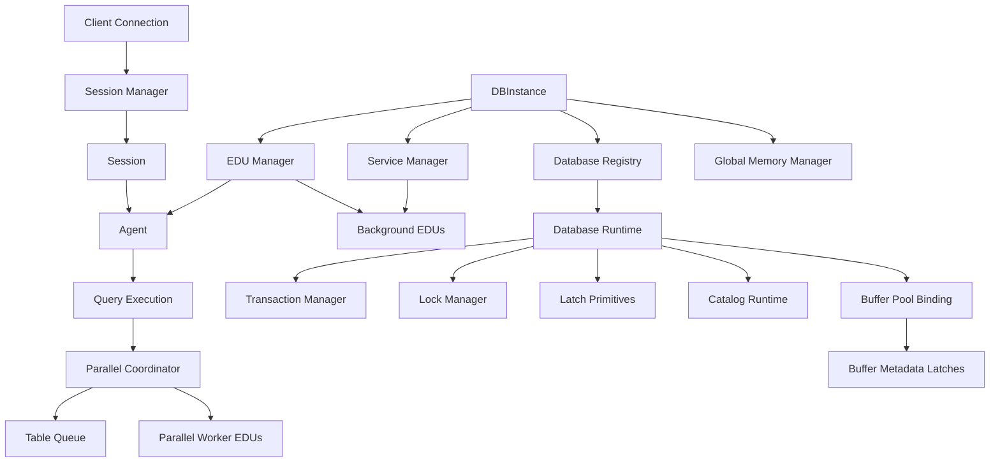

# Day 1 Runtime Foundation

Feature Name: day1-runtime-foundation
Updated: 2026-05-24

## Description

This design defines the first formal implementation milestone for a serious C++ relational database engine. The goal of Day 1 is to establish the engine runtime foundation before SQL, storage, recovery, or query processing internals are implemented.

The Day 1 runtime foundation introduces:

1. A top-level instance runtime model
2. A database activation model
3. An EDU-based execution framework
4. An agent-based application servicing model
5. Hierarchical memory domains
6. Explicit C++ ownership rules
7. Runtime registry and interruption control
8. A minimal implementation and test plan
9. A concurrency vocabulary that separates logical locks, internal latches, and parallel exchange coordination

## Architecture



### Runtime hierarchy

The Day 1 runtime model is organized around four major scope boundaries:

1. `DBInstance`
2. `DatabaseRuntime`
3. `Session` or `ApplicationContext`
4. `QueryExecution`

The system follows a DB2-inspired runtime model where the instance is the root operational boundary, database runtimes are activatable children, and both foreground and background engine work are represented through EDUs.

### Concurrency domains

The engine architecture must treat three concurrency domains as distinct design concerns:

1. **Logical locks** for user-visible data protection and transaction isolation
2. **Internal latches** for short critical sections over shared engine memory structures
3. **Parallel exchange queues** for coordinator or worker communication during parallel execution

These domains have different ownership, duration, observability, and failure behavior. The engine must keep them separated in both interfaces and metrics.

## Repository Layout

The Day 1 repository layout must match the Day 1 runtime bootstrap plan and expose the major code, test, tool, and documentation boundaries from the start.

```text
/northdb
  /cmake
  /docs
    /architecture
  /src
    /common
    /runtime
    /memory
    /network
    /catalog
    /storage
    /txn
    /lock
    /wal
    /recovery
    /executor
    /parser
    /optimizer
    /utility
    /replication
  /tests
    /unit
    /integration
  /tools
```

The implementation scope for Day 1 task `1.1` is the creation of this repository scaffold only. The task does not yet require class skeletons, build rules, or executable tests.

## Components and Interfaces

### 1. `DBInstance`

`DBInstance` is the top-level owner of the database engine runtime.

Responsibilities:

1. Own global configuration
2. Own the global memory root
3. Own runtime registries and managers
4. Start and stop core services
5. Coordinate database activation and shutdown
6. Enter quiesce state for controlled shutdown or maintenance

Core API:

```cpp
class DBInstance {
public:
    Status Initialize();
    Status Start();
    Status Quiesce();
    Status Stop();
    InstanceState State() const noexcept;
};
```

### 2. `DatabaseRuntime`

`DatabaseRuntime` is the in-memory runtime container for one database.

Responsibilities:

1. Activate database-local services
2. Coordinate mount and recovery stages
3. Expose database-level transaction and lock systems
4. Own the database memory root
5. Support quiesce and deactivate flows
6. Coordinate database-level logical locking and internal latch policy boundaries

Core API:

```cpp
class DatabaseRuntime {
public:
    Status Activate();
    Status Recover();
    Status Quiesce();
    Status Deactivate();
    DatabaseState State() const noexcept;
};
```

### 3. `EDU`

`EDU` is the common execution abstraction for all engine work.

Concurrency-related EDU roles include:

1. Foreground agent execution that acquires logical locks through transaction-aware paths
2. Background deadlock detection for logical lock waits
3. Parallel worker execution that may contend on table queues and buffer metadata latches

Foreground EDU examples:

1. `AgentEDU`
2. `UtilityJobEDU`
3. `ParallelQueryWorkerEDU` in later phases

Background EDU examples:

1. `LogWriterEDU`
2. `PageCleanerEDU`
3. `CheckpointEDU`
4. `PrefetchEDU`
5. `DeadlockDetectorEDU`
6. `RecoveryMasterEDU`
7. `RecoveryWorkerEDU`

Core interface:

```cpp
class EDU {
public:
    virtual ~EDU() = default;
    virtual EduId Id() const noexcept = 0;
    virtual EDUType Type() const noexcept = 0;
    virtual std::string_view Name() const noexcept = 0;
    virtual void Run() = 0;
    virtual void RequestStop() = 0;
};
```

### 4. `Agent`

`Agent` is the foreground runtime unit that services an application request.

Responsibilities:

1. Bind to a session for request execution
2. Own query-scoped execution state while active
3. Attach to transaction state
4. Enforce cancellation and timeout checks
5. Report execution metrics and status
6. Surface wait classification for lock waits, latch waits, queue waits, and other runtime waits

Execution path:

```text
Connection -> Session -> Agent -> Transaction Context -> QueryExecution
```

### 5. `Session`

`Session` is the long-lived client runtime context.

Responsibilities:

1. Authentication state
2. Session variables
3. Prepared statement cache later
4. Session memory context
5. Current transaction binding
6. Interrupt token root

### 6. Logical locking model

Logical locks protect user-visible data and schema resources.

Design principles:

1. Locks are owned by transaction or session state
2. Locks are isolation-aware and waitable
3. Locks participate in deadlock detection
4. Lock scopes will later include row, page, table, and higher-level object scopes
5. Lock escalation is a policy mechanism to trade concurrency for bounded lock-table pressure

Initial reserved interfaces:

```text
src/lock/lock_mode.h
src/lock/lock_request.h
src/lock/lock_manager.h
src/lock/lock_escalation_policy.h
```

### 7. Internal latch model

Latches protect internal shared-memory structures such as buffer-pool metadata, queue state, and other high-frequency engine structures.

Design principles:

1. Latches are held for very short critical sections
2. Latches are not transaction-visible resources
3. Latches must not be held across blocking I/O
4. Latches must not be held while waiting on logical locks
5. Latch contention must be observable by latch class and protected structure

Initial reserved interfaces:

```text
src/storage/latch.h
src/storage/latch_guard.h
```

### 8. Parallel exchange coordination

Parallel execution introduces an independent coordination domain through shared exchange queues.

Design principles:

1. Parallel workers communicate through bounded queue structures
2. Queue contention must be treated as an execution and optimizer cost
3. Highly selective row-goal queries should later suppress parallel fan-out when queue and latch overhead outweighs scan benefit

Initial reserved interfaces:

```text
src/executor/table_queue.h
src/executor/parallel_execution_policy.h
```

### 9. `MemoryContext`

`MemoryContext` is the fundamental allocation, accounting, and cleanup abstraction.

Core interface:

```cpp
class MemoryContext {
public:
    virtual ~MemoryContext() = default;
    virtual void* Allocate(size_t bytes,
                           size_t alignment = alignof(std::max_align_t)) = 0;
    virtual void Deallocate(void* ptr, size_t bytes) = 0;
    virtual void Reset() = 0;
    virtual size_t UsedBytes() const noexcept = 0;
    virtual size_t PeakBytes() const noexcept = 0;
    virtual size_t LimitBytes() const noexcept = 0;
};
```

### 10. `ServiceManager`

`ServiceManager` is responsible for lifecycle coordination of always-on engine services.

Responsibilities:

1. Register services
2. Start services in a defined order
3. Stop services in a defined order
4. Propagate failures into runtime state

### 11. `RuntimeRegistry` and `InterruptToken`

`RuntimeRegistry` tracks active engine objects.

The runtime registry and future diagnostics model must classify waits by domain, including:

1. lock waits
2. latch waits
3. queue waits
4. I/O waits
5. log flush waits

Tracked entity classes:

1. Session
2. Agent
3. Transaction
4. Query
5. Utility job
6. EDU

`InterruptToken` carries runtime cancel and timeout requests.

All long-running operations must be designed to poll this token.

## Data Models

### Runtime identity types

```cpp
using InstanceId = uint64_t;
using DatabaseId = uint64_t;
using SessionId = uint64_t;
using TransactionId = uint64_t;
using QueryId = uint64_t;
using EduId = uint64_t;
```

### Wait-event vocabulary

```cpp
enum class WaitEventClass {
    kNone,
    kLock,
    kLatch,
    kQueue,
    kIo,
    kLogFlush
};
```

### Instance state machine

```cpp
enum class InstanceState {
    kCreated,
    kInitializing,
    kRecovering,
    kRunning,
    kQuiescing,
    kStopping,
    kStopped,
    kFailed
};
```

Valid transition flow:

```text
kCreated -> kInitializing -> kRecovering -> kRunning
kRunning -> kQuiescing -> kStopping -> kStopped
Any operational state -> kFailed
```

### Database state machine

```cpp
enum class DatabaseState {
    kRegistered,
    kMounting,
    kRecovering,
    kActive,
    kQuiesced,
    kStopping,
    kStopped,
    kFailed
};
```

Valid transition flow:

```text
kRegistered -> kMounting -> kRecovering -> kActive
kActive -> kQuiesced -> kStopping -> kStopped
Any operational state -> kFailed
```

### Agent state machine

```cpp
enum class AgentState {
    kIdle,
    kAssigned,
    kRunning,
    kWaiting,
    kCancelling,
    kFinished,
    kFailed
};
```

### Memory context hierarchy

```text
InstanceMemoryContext
  |- ServiceMemoryContext
  |- AgentPoolMemoryContext
  |- BufferPoolMemoryContext
  |- WALMemoryContext
  |- RecoveryMemoryContext
  |- CatalogMemoryContext
  |- DatabaseMemoryContext(db1)
  |    |- TxnSystemMemoryContext
  |    |- LockSystemMemoryContext
  |    |- LatchSystemMemoryContext
  |    |- SessionMemoryContext(s1)
  |    |    |- QueryMemoryContext(q1)
  |    |    |    |- OperatorMemoryContext(scan)
  |    |    |    |- OperatorMemoryContext(hash_join)
  |    |    |    |- OperatorMemoryContext(exchange_queue)
  |    |    |- QueryMemoryContext(q2)
  |    |- SessionMemoryContext(s2)
  |- DatabaseMemoryContext(db2)
```

## Correctness Properties

### Ownership and lifecycle invariants

1. Every runtime object must have one clear lifecycle owner.
2. Every memory scope must have one clear parent scope except the instance root.
3. Every active query must execute under exactly one agent.
4. Every active agent must be associated with at most one active request.
5. Every database runtime must belong to exactly one instance.
6. Every long-running operation must have an interrupt token.
7. No logical lock wait may occur while a latch critical section is held.
8. No blocking I/O may occur while a latch critical section is held.

### C++ ownership rules

1. Exclusive subsystem ownership uses `std::unique_ptr`.
2. Non-owning object references use raw pointers or references.
3. Scoped resource release must use RAII guards.
4. Query-local containers should be compatible with `std::pmr` or equivalent scoped allocation strategies.

### Runtime control invariants

1. Invalid lifecycle transitions return explicit failure status.
2. Quiesce state stops admission of new work before shutdown continues.
3. Session teardown must release session memory and detach active request state.
4. Query teardown must release query and operator memory contexts.
5. Wait reporting must preserve the distinction between lock, latch, and queue contention.

### Concurrency-control invariants

1. Logical locks and internal latches use separate APIs and ownership paths.
2. Lock escalation later becomes policy-driven and observable.
3. Parallel exchange queues later become explicit execution objects rather than implicit thread communication paths.
4. Buffer-pool metadata latching later uses sharded or partitioned protection to reduce central contention.

## Error Handling

### Startup and lifecycle errors

1. If instance initialization fails, the instance enters `kFailed`.
2. If database activation fails, the database enters `kFailed`.
3. If service startup fails, the owning runtime returns an error and records the failure state.

### Memory errors

1. If a memory context exceeds a configured hard limit, the allocator returns an explicit failure.
2. Query-scoped memory-limit breaches should later integrate with spill policies for sort and hash operators.

### Concurrency errors

1. Lock timeouts, deadlocks, and cancellation outcomes must be reported separately from latch contention.
2. Parallel queue overload or queue shutdown must surface a dedicated execution failure status.

### Interruption errors

1. If an interrupt token is set to cancelled, active work returns a cancellation status.
2. If an interrupt token is set to timeout, active work returns a timeout status.

## Test Strategy

### Unit tests

Required Day 1 unit-test targets:

1. Instance lifecycle transitions
2. Database lifecycle transitions
3. Agent lifecycle transitions
4. Memory context usage and peak tracking
5. Interrupt token behavior
6. Service manager start and stop ordering
7. shared identity and status types

### Example test names

1. `DBInstance_TransitionsToRunning`
2. `DBInstance_RejectsInvalidStopBeforeStart`
3. `DatabaseRuntime_ActivateRecoverDeactivateFlow`
4. `MemoryContext_TracksUsageAndPeak`
5. `InterruptToken_RequestsCancel`
6. `Agent_TransitionsIdleAssignedRunningFinished`
7. `ServiceManager_StartsServicesInOrder`

### Scope exclusions for Day 1

The following are intentionally out of scope for Day 1 implementation:

1. SQL parsing
2. Storage engine internals
3. WAL record format
4. Query optimizer internals
5. Lock table implementation
6. Executor operator implementation

The following design obligations are introduced for later phases:

1. Separate lock-manager and latch-layer implementations
2. Observability for lock waits, latch waits, queue waits, and escalation
3. Parallel-execution policy that suppresses costly exchange paths for row-goal selective plans

## References

[^1]: (Website) - [DB2 process model](https://www.ibm.com/docs/en/db2/11.5.x?topic=architecture-db2-process-model)
[^2]: (Website) - [DB2 process overview](https://www.ibm.com/docs/en/db2/11.5.x?topic=architecture-db2-process-overview)
[^3]: (Website) - [DB2 database agents](https://www.ibm.com/docs/en/db2/11.5.x?topic=architecture-database-agents)
[^4]: (Website) - [DB2 application processes, concurrency, and recovery](https://www.ibm.com/docs/en/db2/11.5.x?topic=design-application-processes-concurrency-recovery)
