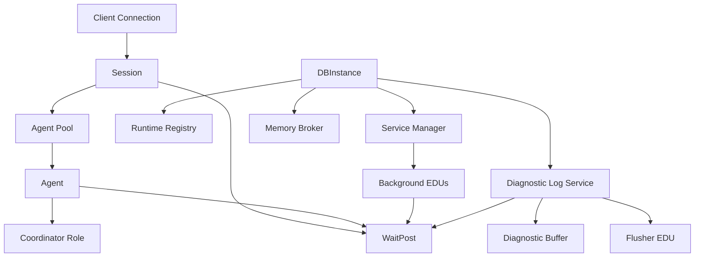

# Day 2 Runtime Core

Feature Name: day2-runtime-core
Updated: 2026-05-27

## Description

This design defines the Day 2 implementation direction for the runtime core that grows out of the Day 1 runtime foundation. The goal of Day 2 is to move from interface-only runtime skeletons toward a minimally runnable runtime core with concrete coordination primitives, stronger ownership wiring, and explicit synchronization semantics.

Day 2 focuses on:

1. runtime registration and ownership wiring
2. richer session and agent state vocabulary
3. a handle-based runtime registry
4. a bootstrap memory-broker implementation boundary
5. a bootstrap diagnostic publish path
6. a reusable `WaitPost` runtime synchronization primitive

## Architecture



## Components and Interfaces

### 1. Runtime synchronization with `WaitPost`

Day 2 introduces `WaitPost` as a low-level runtime synchronization primitive for event-style coordination between foreground sessions, pooled agents, and background EDUs.

The design follows the operational shape observed in Db2 waitpost behavior:

1. the waiter publishes wait intent in shared state
2. the waiter then blocks in the kernel or runtime wait primitive
3. the poster signals completion or readiness with a post operation
4. the waiter wakes without polling loops

`WaitPost` is an event primitive. It is not a request-response message channel.

#### Supported semantics

`WaitPost` must support two modes:

1. `kStickyEvent`
2. `kAutoReset`

`kStickyEvent` keeps the posted state visible until an explicit reset. This mode fits startup, shutdown, and one-time readiness transitions.

`kAutoReset` releases one waiter per post and returns to a non-posted state after wakeup handoff. This mode fits worker handoff, bounded service coordination, and timer-style wakeup behavior.

#### Shared state model

The primitive should expose a small internal state model:

1. `posted`
2. `waiter_count`
3. `generation`
4. `mode`

`generation` exists to prevent stale wakeups from leaking across reuse, reset, detach, reassignment, or lifecycle transitions.

#### API direction

```cpp
class WaitPost {
public:
    enum class Mode {
        kStickyEvent,
        kAutoReset,
    };

    virtual ~WaitPost() = default;

    virtual Status Wait(std::chrono::milliseconds timeout) = 0;
    virtual Status Post() = 0;
    virtual Status Reset() = 0;
    virtual std::uint32_t WaiterCount() const noexcept = 0;
    virtual bool IsPosted() const noexcept = 0;
    virtual std::uint64_t Generation() const noexcept = 0;
    virtual Mode mode() const noexcept = 0;
};
```

The first Day 2 version may be implemented with standard C++ synchronization primitives inside one process. The interface should preserve room for future process-crossing or platform-specific wait implementations.

#### Locking rules

`WaitPost` needs two coordination layers:

1. a very short internal critical section for bookkeeping over `posted`, `waiter_count`, and `generation`
2. a higher-level lifecycle latch or state guard owned by surrounding runtime components

The internal critical section protects local wait-state transitions.

The higher-level lifecycle guard protects ownership rules such as:

1. which runtime object owns the wait channel
2. when reset is legal
3. when post is legal during startup, shutdown, detach, or reassignment
4. when a wait channel can be reused by another session, agent, or service phase

This split keeps `WaitPost` small while preserving correctness around post and reset races.

#### Reset behavior

`Reset()` must establish a fresh waiting generation and clear reusable posted state.

Reset behavior must ensure:

1. stale wakeups cannot satisfy a future wait after lifecycle reassignment
2. posted state from a previous service phase cannot leak into a later phase
3. repeated service startup and shutdown can reuse the primitive safely

#### Error handling

`Wait()` should return explicit status for:

1. success by post
2. timeout
3. cancellation or shutdown interruption
4. invalid lifecycle usage such as waiting on a retired channel

`Post()` and `Reset()` should return explicit status for invalid ownership or illegal lifecycle phase transitions.

### 2. Runtime integration points

Day 2 should wire `WaitPost` into the following runtime touchpoints.

#### `Session`

`Session` should reserve a wait channel for detach-capable waits such as:

1. request completion notification
2. cancel acknowledgement
3. idle-to-active handoff notification

#### `Agent`

`Agent` should reserve a wait channel for execution handoff and completion signaling.

This keeps attached execution state separate from durable session state while preserving explicit coordination points.

#### `DBInstance` and `DatabaseRuntime`

Lifecycle control should reserve wait channels for:

1. service startup readiness
2. service quiesce acknowledgement
3. background EDU shutdown completion

#### `DiagnosticLogService`

The logging subsystem should reserve wait channels for:

1. flusher wakeup on publish
2. flush-on-demand events
3. shutdown drain coordination

### 3. Relationship to existing concurrency domains

`WaitPost` is not a replacement for logical locks, internal latches, or parallel exchange queues.

Its role is runtime event coordination.

The concurrency model remains split across four concerns:

1. logical locks for data isolation
2. internal latches for short shared-memory protection
3. exchange queues for executor dataflow and worker coordination
4. waitpost channels for event-style wakeup and lifecycle synchronization

### 4. Test strategy

Day 2 test coverage for `WaitPost` must verify both semantics and lifecycle safety.

#### Unit tests

1. sticky event wait returns immediately after post until reset
2. auto-reset post wakes one waiter and clears posted state
3. wait timeout returns a timeout status without leaving posted state behind
4. reset after post creates a fresh generation and prevents stale wakeup reuse
5. repeated wait and post cycles preserve waiter-count accounting
6. concurrent waiters do not require polling and block until post or timeout
7. invalid reset or post under retired ownership returns an error status

#### Integration-oriented runtime tests

1. service startup readiness can wake a waiting controller
2. session and agent handoff can signal completion without permanent attachment
3. diagnostic flusher wakeup can be triggered by publish activity
4. shutdown coordination can drain waiting workers cleanly

## Data Models

```cpp
struct WaitPostState {
    bool posted;
    std::uint32_t waiter_count;
    std::uint64_t generation;
    WaitPost::Mode mode;
};
```

The implementation may use additional private fields for mutex, condition variable, stop state, or platform handles.

## Correctness Properties

1. `WaitPost` must not require active polling by waiters.
2. `WaitPost` must preserve a clean separation between wait-state bookkeeping and higher-level lifecycle ownership.
3. `WaitPost` must prevent stale wakeups from crossing generation boundaries.
4. `WaitPost` must preserve observable waiter counts for diagnostics and runtime accounting.
5. `WaitPost` must keep event coordination separate from logical locking, latching, and exchange dataflow.

## References

1. `.monkeycode/specs/2026-05-24-day1-runtime-foundation/design.md`
2. `.monkeycode/docs/ARCHITECTURE.md`
3. `.monkeycode/docs/INTERFACES.md`
4. User-provided Db2 waitpost analysis on `sqloResetIPCWaitPost()` and related wait and post behavior
